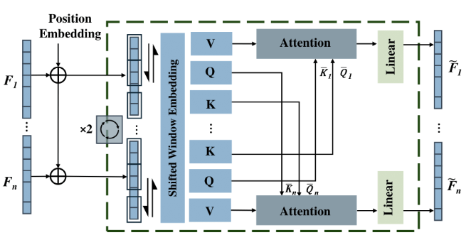

<!-- * B.S. in Communication Engineering, Hefei University of Technology, 2019
* M.S. in Computer Science and Technology, Harbin Institute of Technology, 2021
* Ph.D. in Computer Science and Technology, Harbin Institute of Technology, 2025 (expected) -->
Hi, this is Yingdong Hu. I am a second-year (2023~) Ph.D. student in Electronic and Computer Engineering department, the Hongkong University of Science and Technology, advised by Prof. [Jun ZHANG](https://eejzhang.people.ust.hk/home.html).
My research focuses on **3D/4D Reconstruction, Delivery and Present**, including feed forward 3D/4D reconstruction, 3D streaming, holographic communication, etc.

<!-- - &#x1F525; **I'm looking for internship opportunities in human-centric reconstruction!!!** -->

## Background

<table style="width:100%;border:none;border-spacing:0px;border-collapse:separate;margin-right:auto;margin-left:auto;font-size: large">
<tr>
<!-- <td style="padding:20px;width:25%;vertical-align:middle;border:none" align="center"> -->
<!--   -->
<!-- </td> -->
<td style="padding:20px;width:75%;vertical-align:middle;border: none" align="left">
Ph.D. Student. Sep. 2023 - Present 
<a href="https://ece.hkust.edu.hk/">Electronic and Computer Engineering</a> 
<a href="https://hkust.edu.hk/">Hongkong University of Science and Technology</a> 
</td>
</tr>

<tr>
<!-- <td style="padding:20px;width:25%;vertical-align:middle;border:none" align="center"> -->
<!--   -->
<!-- </td> -->
<td style="padding:20px;width:75%;vertical-align:middle;border: none" align="left">
Bachelor of Engineering. Sep. 2019 - Jun. 2023 
<a href="https://www.cse.zju.edu.cn">Automation</a> 
<a href="https://www.zju.edu.cn">Zhejiang University</a> 
</td>
</tr>
</table>    

## Internship

<b>2025.4 - Now,</b> Tongyi Lab, Alibaba, mentored by Dr.[Yisheng He](https://hyshkust.github.io/) and Dr.[Zilong Dong](https://baike.baidu.com/item/%E8%91%A3%E5%AD%90%E9%BE%99/62931048).

<!-- ## Research -->

<!--  -->
## Fast 3D/4D Reconstruction
- &#x1F4DA; EVA-Gaussian: 3D Gaussian-Based Real-time Human Novel View Synthesis Under Diverse Camera Settings(ICCV Workshop 2025)
<!-- </b>  -->
 <b>Yingdong Hu</b>, [Zhening Liu](https://liuzhening111.github.io/), [Jiawei Shao](https://shaojiawei07.github.io/), [Zehong Lin](https://zhlinup.github.io/), [Jun Zhang](https://eejzhang.people.ust.hk/home.html) 
[<i class="fas fa-fw fa-globe"></i>Project](https://zhenliuzju.github.io/huyingdong/EVA-Gaussian) /
[<i class="fas fa-fw fa-file-pdf"></i>Paper](https://arxiv.org/pdf/2410.01425) /
[<i class="fab fa-fw fa-github fa-github"></i>Code](https://zhenliuzju.github.io/huyingdong/EVA-Gaussian) /
[<i class="fas fa-fw fa-video"></i>Video](https://zhenliuzju.github.io/huyingdong/EVA-Gaussian) 

- &#x1F4DA; Dynamics-Aware Gaussian Splatting Streaming Towards Fast On-the-Fly Training for 4D Reconstruction(Submitted)
<!-- </b>  -->
 [Zhening Liu](https://liuzhening111.github.io/), <b>Yingdong Hu</b>, [Xinjie Zhang](https://xinjie-q.github.io/), [Jiawei Shao](https://shaojiawei07.github.io/), [Zehong Lin](https://zhlinup.github.io/), [Jun Zhang](https://eejzhang.people.ust.hk/home.html) 
[<i class="fas fa-fw fa-globe"></i>Project](https://www.liuzhening.top/DASS) /
[<i class="fas fa-fw fa-file-pdf"></i>Paper](https://arxiv.org/abs/2411.14847) /
[<i class="fab fa-fw fa-github fa-github"></i>Code](https://github.com/LIUZhening111/DASS) /
[<i class="fas fa-fw fa-video"></i>Video](https://youtu.be/4ZUTpI6WRdQ) 

## Other Publication

### 3D Gaussian for Wireless Communication
- &#x1F4DA; WRF-GS: Wireless Radiation Field Reconstruction with 3D Gaussian Splatting, INFOCOM 2025 (CCF A)
<!-- </b>  -->
 Chaozheng Wen, [Jinwen Tong](https://jwentong.github.io/), <b>Yingdong Hu</b>, [Zehong Lin](https://zhlinup.github.io/), [Jun Zhang](https://eejzhang.people.ust.hk/home.html) 
[<i class="fas fa-fw fa-file-pdf"></i>Paper](https://arxiv.org/abs/2412.04832) 

## Contact
E-mail: yingdong.hu[AT]connect.ust.hk 
WeChat: huyingdong_zju

    

